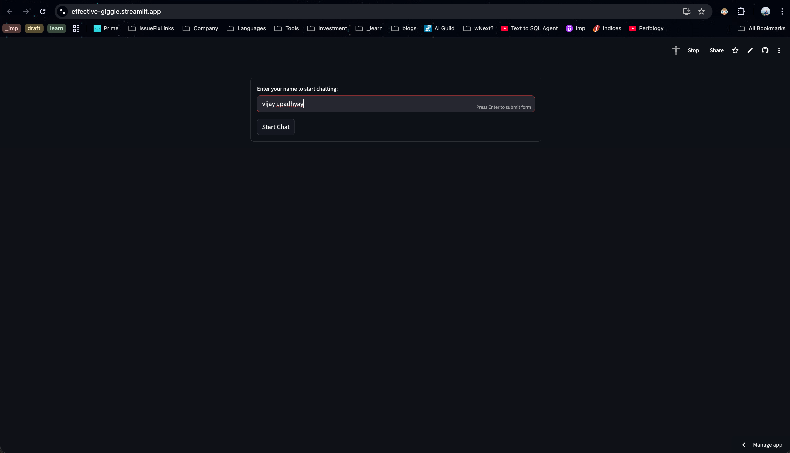
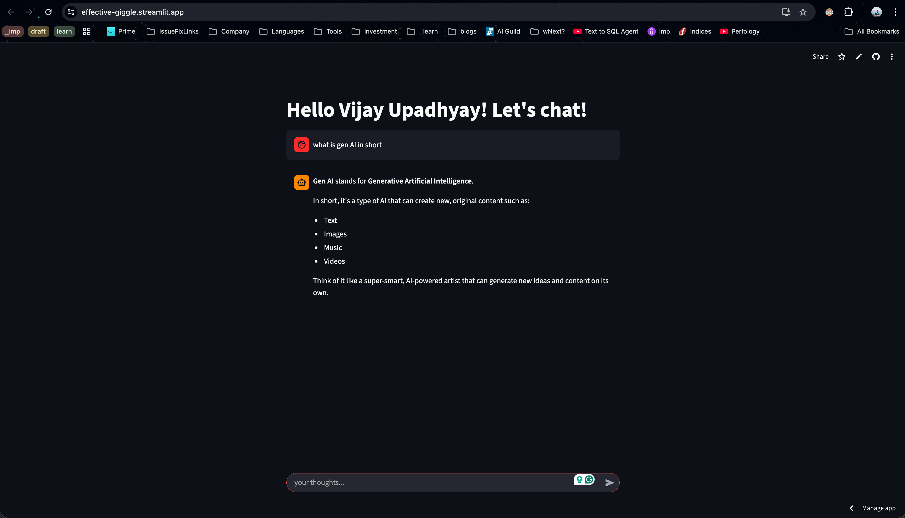

# 🚀 effective-giggle

A chatbot application built using an **LLM model** and a **Streamlit UI**. This project demonstrates how to create an interactive conversational interface powered by modern language models.

---

## 🌐 Live Demo
The chatbot is hosted and available here:  
👉 [Effective Giggle](https://effective-giggle.streamlit.appeting)

- **Interactive Chat**: Start chatting instantly after the greeting.
- **Streamlit UI**: Clean and responsive interface for smooth user experience.

---

## 🛠️ Tech Stack
- **Language**: Python
- **Framework**: Streamlit
- **Packages Used**:
  - `streamlit`
  - `python-dotenv`
  - `langchain-community`
  - `langchain-groq`

---

## 📸 Screenshots

### 1. Enter Your Name
- Provide your preferred name or username:



### 2. Start Chatting
The bot greets you and is ready for conversation:


---

## ▶️ How to Run Locally
1. **Clone the repository**:
   ```bash
   git clone <repo-url>
   cd effective-giggle
   pip install -r requirements.txt
   streamlit run chatbot.py

